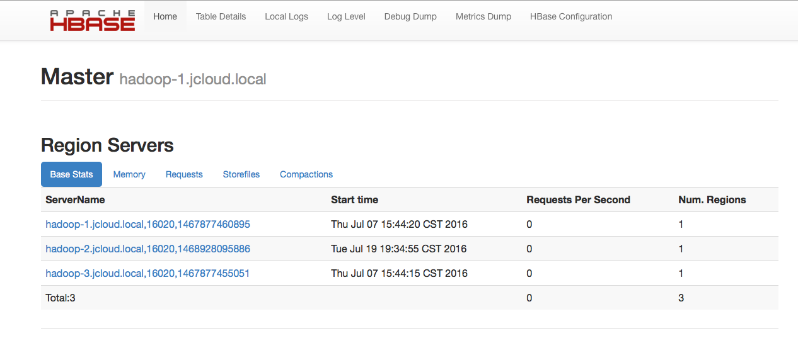

# HBase

 

版本：v1.1.2

HBase 是一个分布式的、面向列的开源数据库。基于列的模式，是一个适合于非结构化数据存储的数据库。

## HBase 后端服务

### 申请 HBase 实例

查看后端服务、申请后端服务实例、绑定后端服务实例参见功能介绍《第四节 后端支持服务》章节。

### HBase 仪表盘



### HBase 实例环境变量举例

- BSI:

    ```
    - name: BSI_HBASE_HBASEDEMO_URI
      value: 36.110.131.65:2181:/hbase-secure
    - name: BSI_HBASE_HBASEDEMO_NAME
      value: 59e695e786ba11e68852fa163d0e0615
    - name: BSI_HBASE_HBASEDEMO_USERNAME
      value: serviceinstance_43185cc2-8e28-4d54-8612-6b05cf50c2a3@ASIAINFO.COM
    - name: BSI_HBASE_HBASEDEMO_PASSWORD
      value: 29a7735b-5eb9-40f2-baa8-ab1ffb8a774e
    - name: BSI_HBASE_HBASEDEMO_HOST
      value: 36.110.131.65
    - name: BSI_HBASE_HBASEDEMO_PORT
      value: 2181
    ```

- JSON:

    ```
    {
        "HBase": [
            {
                "credentials": {
                    "Host": "36.110.131.65",
                    "Name": "59e695e786ba11e68852fa163d0e0615",
                    "Password": "29a7735b-5eb9-40f2-baa8-ab1ffb8a774e",
                    "Port": "2181",
                    "Uri": "36.110.131.65:2181:/hbase-secure",
                    "Username": "serviceinstance_43185cc2-8e28-4d54-8612-6b05cf50c2a3@ASIAINFO.COM",
                    "Vhost": ""
                },
                "label": "",
                "name": "hbasedemo",
                "plan": "shared"
            }
        ]
    }
    ```

### 使用 HBase 实例

- 使用HDFS实例与服务绑定返回的BSI_HBASE_HBASEDEMO_URI, BSI_HBASE_HBASEDEMO_NAME, BSI_HBASE_HBASEDEMO_USERNAME, BSI_HBASE_HBASEDEMO_PASSWORD, BSI_HBASE_HBASEDEMO_HOST, BSI_HBASE_HBASEDEMO_PORT连接HBase实例，环境变量说明如下：
    - BSI_HBASE_HBASEDEMO_URI: HBase实例URI
    - BSI_HBASE_HBASEDEMO_NAME: HBase的命名空间(NameSpace)名
    - BSI_HBASE_HBASEDEMO_USERNAME: HBase实例的用户名
    - BSI_HBASE_HBASEDEMO_PASSWORD: HBase实例的用户密码
    - BSI_HBASE_HBASEDEMO_HOST: Zookeeper的quorum主机列表
    - BSI_HBASE_HBASEDEMO_PORT: Zookeeper的端口

- 在服务代码中,通过代码方式(以JAVA为例)获取Kerberos票据:
    - 利用Broker注入的Credential信息(BSI_HBASE_HBASEDEMO_USERNAME/BSI_HBASE_HBASEDEMO_PASSWORD),
    构造javax.security.auth.Subject对象;
    - 通过Hadoop的UserGroupInformation.loginUserFromSubject方法获取Kerberos票据

- 在服务代码中,根据Broker注入的HBase URI及Zookeeper信息(BSI_HBASE_HBASEDEMO_URI, BSI_HBASE_HBASEDEMO_HOST,BSI_HBASE_HBASEDEMO_PORT),
利用HBase的JAVA API访问Broker为用户分配的HBase命令空间

## 其他文档

- 官方网站： http://hbase.apache.org/
- 官方文档： http://abloz.com/hbase/book.html
- API 文档： http://hbase.apache.org/devapidocs/index.html
- User API： http://hbase.apache.org/apidocs/index.html
