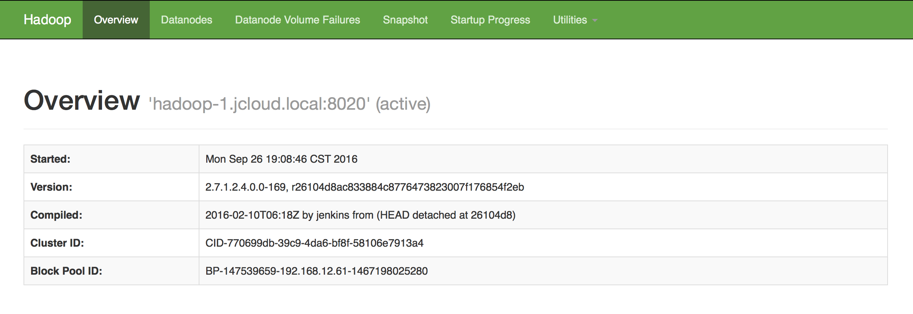

# HDFS

 

版本：v2.7.1

Hadoop 分布式文件系统。有着高容错性的特点，并且设计用来部署在低廉的硬件上。适合有着超大数据集的应用程序。HDFS 放宽了 POSIX 的要求,可以实现流的形式访问文件系统中的数据。

# HDFS后端服务

## 申请HDFS实例

查看后端服务、申请后端服务实例、绑定后端服务实例参见功能介绍《第四节 后端支持服务》章节。

## HDFS仪表盘



## HDFS实例环境变量举例

 - BSI:

    ```
    - name: BSI_HDFS_HDFSSAMPLE_URI
      value: http://36.110.131.65:50070/webhdfs/v1/servicebroker/de1dc247-8662-11e6-8852-fa163d0e0615
    - name: BSI_HDFS_HDFSSAMPLE_NAME
      value: /servicebroker/de1dc247-8662-11e6-8852-fa163d0e0615
    - name: BSI_HDFS_HDFSSAMPLE_USERNAME
      value: serviceinstance_6be1d076-60e3-40f5-9f3d-7bc4a5a1674b@ASIAINFO.COM
    - name: BSI_HDFS_HDFSSAMPLE_PASSWORD
      value: 77b60338-ecb8-4148-8da2-d880a91c3dbd
    - name: BSI_HDFS_HDFSSAMPLE_HOST
      value: 36.110.131.65
    - name: BSI_HDFS_HDFSSAMPLE_PORT
      value: 50070
    ```

 - JSON:

    ```
    {
    "HDFS": [
        {
            "credentials": {
                "Host": "36.110.131.65",
                "Name": "/servicebroker/de1dc247-8662-11e6-8852-fa163d0e0615",
                "Password": "77b60338-ecb8-4148-8da2-d880a91c3dbd",
                "Port": "50070",
                "Uri": "http://36.110.131.65:50070/webhdfs/v1/servicebroker/de1dc247-8662-11e6-8852-fa163d0e0615",
                "Username": "serviceinstance_6be1d076-60e3-40f5-9f3d-7bc4a5a1674b@ASIAINFO.COM",
                "Vhost": ""
            },
            "label": "",
            "name": "hdfssample",
            "plan": "shared"
        }
    ]
   }
   ```

## 使用HDFS实例

 - 使用HDFS实例与服务绑定返回的BSI_HDFS_HDFSDEMO_URI，BSI_HDFS_HDFSDEMO_NAME， BSI_HDFS_HDFSDEMO_USERNAME， BSI_HDFS_HDFSDEMO_PASSWORD， BSI_HDFS_HDFSDEMO_HOST， BSI_HDFS_HDFSDEMO_PORT连接HDFS实例，环境变量说明如下：
     - BSI_HDFS_HDFSDEMO_URI：HDFS实例的URI
     - BSI_HDFS_HDFSDEMO_NAME：HDFS实例的目录名
     - BSI_HDFS_HDFSDEMO_USERNAME：HDFS实例的用户名
     - BSI_HDFS_HDFSDEMO_PASSWORD：HDFS实例的用户密码
     - BSI_HDFS_HDFSDEMO_HOST：HDFS NameNode的IP
     - BSI_HDFS_HDFSDEMO_PORT：HDFS NameNode的Http端口
 - 用oc命令进入容器，在进入容器的当前路径下执行kerberos的kinit命令获取票据：

       kinit $BSI_HDFS_HDFSDEMO_USERNAME <<!!
          $BSI_HDFS_HDFSDEMO_PASSWORD
       !!

 - 利用HDFS的REST接口操作HDFS实例，例如列出用户目录下的所有文件及子目录：

       curl -i -v --negotiate -u : -b /tmp/cookiejar.txt -c /tmp/cookiejar.txt http://${BSI_HDFS_HDFSDEMO_HOST}:${BSI_HDFS_HDFSDEMO_PORT}/webhdfs/v1"+${BSI_HDFS_HDFSDEMO_NAME}+"?op=liststatus

 - 具体可以参考例子: https://github.com/asiainfoLDP/datafoundry_hadoop_demo

## 其它文档

 - 官方文档: https://hadoop.apache.org/docs/r2.7.1/
 - 帮助文档：https://hadoop.apache.org/docs/r2.7.1/hadoop-project-dist/hadoop-hdfs/HdfsUserGuide.html
 - 官方教程：https://hadoop.apache.org/docs/r2.7.1/hadoop-project-dist/hadoop-hdfs/HdfsUserGuide.html
 - API文档：https://hadoop.apache.org/docs/r2.7.1/hadoop-project-dist/hadoop-hdfs/WebHDFS.html

