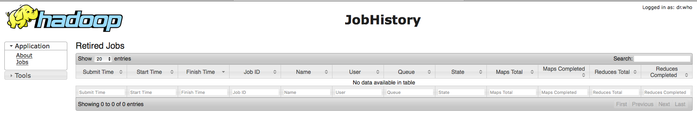

# MapReduce


版本：v2.7.1

Hadoop MapReduce是一个可以快速编写能够在大规模集群(数千节点)上处理大规模数据(TB级)的可靠的，容错的应用的软件框架。

## MapReduce后端服务

### 申请MapReduce实例

查看后端服务、申请后端服务实例、绑定后端服务实例参见功能介绍《第四节 后端支持服务》章节。

### MapReduce仪表盘



### MapReduce实例环境变量举例

- BSI:

```
    - name: BSI_MAPREDUCE_MAPREDUCEDEMO_URI
      value: http://36.110.132.55:8088
    - name: BSI_MAPREDUCE_MAPREDUCEDEMO_NAME
      value: root.b2cf1fc3-cabc-4c64-982d-c39365ca0c4b
    - name: BSI_MAPREDUCE_MAPREDUCEDEMO_USERNAME
      value: serviceinstance_9046f955-067e-4a6d-9052-9134967275cf@ASIAINFO.COM
    - name: BSI_MAPREDUCE_MAPREDUCEDEMO_PASSWORD
      value: 8268edc5-1db7-4437-9839-20276ab1b308
    - name: BSI_MAPREDUCE_MAPREDUCEDEMO_HOST
      value: hadoop-2.jcloud.local
    - name: BSI_MAPREDUCE_MAPREDUCEDEMO_PORT
      value: 8088
```

- JSON:

```
{
    "MapReduce": [
        {
            "credentials": {
                "Host": "hadoop-2.jcloud.local",
                "Name": "root.b2cf1fc3-cabc-4c64-982d-c39365ca0c4b",
                "Password": "8268edc5-1db7-4437-9839-20276ab1b308",
                "Port": "8088",
                "Uri": "http://36.110.132.55:8088",
                "Username": "serviceinstance_9046f955-067e-4a6d-9052-9134967275cf@ASIAINFO.COM",
                "Vhost": ""
            },
            "label": "",
            "name": "mapreducedemo",
            "plan": "shared"
        }
    ]
}
```

### 使用MapReduce实例

- 使用HDFS实例与服务绑定返回的BSI_MAPREDUCE_MAPREDUCEDEMO_URI, BSI_MAPREDUCE_MAPREDUCEDEMO_NAME, BSI_MAPREDUCE_MAPREDUCEDEMO_USERNAME, BSI_MAPREDUCE_MAPREDUCEDEMO_PASSWORD, BSI_MAPREDUCE_MAPREDUCEDEMO_HOST, BSI_MAPREDUCE_MAPREDUCEDEMO_PORT接MapReduce实例，环境变量说明如下：
    - BSI_MAPREDUCE_MAPREDUCEDEMO_URI: Yarn ResourceManager的URI
    - BSI_MAPREDUCE_MAPREDUCEDEMO_NAME: Yarn的资源队列名
    - BSI_MAPREDUCE_MAPREDUCEDEMO_USERNAME: MapReduce实例的用户名
    - BSI_MAPREDUCE_MAPREDUCEDEMO_PASSWORD: MapReduce实例的用户密码
    - BSI_MAPREDUCE_MAPREDUCEDEMO_HOST: Yarn ResourceManager的主机名
    - BSI_MAPREDUCE_MAPREDUCEDEMO_PORT: Yarn ResourceManager的端口

- 在服务代码中,通过代码方式(以JAVA为例)获取Kerberos票据:
    - 利用Broker注入的Credential信息(BSI_MAPREDUCE_MAPREDUCEDEMO_USERNAME/BSI_MAPREDUCE_MAPREDUCEDEMO_PASSWORD),
    构造javax.security.auth.Subject对象;
    - 通过Hadoop的UserGroupInformation.loginUserFromSubject方法获取Kerberos票据

- 在服务代码中,根据Broker注入的Yarn的URI(BSI_MAPREDUCE_MAPREDUCEDEMO_URI)通过代码方式(以JAVA为例)提交MapReduce作业到Broker为用户分配的队列中

## 其他文档

- 官方文档： https://hadoop.apache.org/docs/r2.7.1/
- 帮助文档： http://hadoop.apache.org/docs/current/hadoop-mapreduce-client/hadoop-mapreduce-client-core/MapReduceTutorial.html
- API文档： http://hadoop.apache.org/docs/current/hadoop-yarn/hadoop-yarn-site/ResourceManagerRest.html
