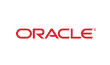

# Oracle_Cloud

 

版本：v11.2

Oracle Cloud 提供的 Oracle 关系型数据库。数据库系统可移植性好、使用方便、功能强，适用于各类大、中、小、微机环境。它是一种高效率、可靠性好的 适应高吞吐量的数据库解决方案。

## Oracle_Cloud 后端服务

### 申请 Oracle_Cloud 实例

查看后端服务、申请后端服务实例、绑定后端服务实例参见功能介绍《第四节 后端支持服务》章节。

### Oracle 仪表盘

无

### Oracle 实例环境变量举例

无法使用

### 使用 Oracle 实例

- 使用 bind 返回的 uri 连接串连接 oracle。

## 其他文档

- 官方网站： https://www.oracle.com/cloud/index.html