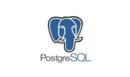
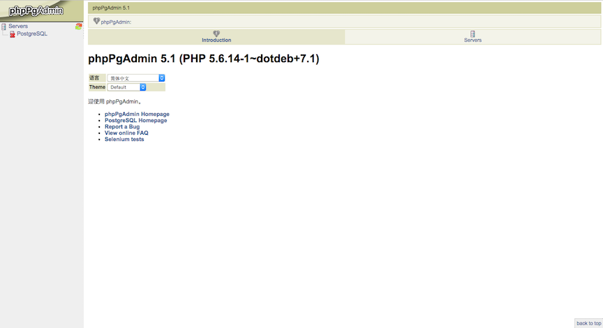

# PostgreSQL

 

版本：v9.4.7

PostgreSQL 对象关系型数据库。最丰富的数据类型的支持，PostgreSQL 支持事务、子查询、多版本并行控制系统（MVCC）、数据完整性检查等特性的一种自由软件的数据库管理系统。

## PostgreSQL 后端服务

### 申请 PostgreSQL 实例

查看后端服务、申请后端服务实例、绑定后端服务实例参见功能介绍《第四节 后端支持服务》章节。

### PostgreSQL 仪表盘

 

### PostgreSQL 实例环境变量举例

- BSI:

```
- name: BSI_PYSPIDER_PYSPIDERTEST_HOST
  value: sb-gemizrxdog4fy-pyspdr.service-brokers.svc.cluster.local
- name: BSI_PYSPIDER_PYSPIDERTEST_PORT
  value: "5000"
```

- JSON:

```
{
  "PySpider": [
    {
      "name": "PySpider-test", 
      "label": "", 
      "plan": "standalone", 
      "credentials": {
        "Host": "sb-gemizrxdog4fy-pyspdr.service-brokers.svc.cluster.local", 
        "Name": "", 
        "Password": "", 
        "Port": "5000", 
        "Uri": "", 
        "Username": "", 
        "Vhost": ""
      }
    }
  ]
}
```

### 使用 PostgreSQL 实例

- 创建 bs 并绑定可以得到 url，username，dbname，password。

## 其他文档

- 官方网站： https://www.postgresql.org/
- 官方文档： https://www.postgresql.org/docs/9.4/static/index.html
- API 文档： https://www.postgresql.org/about/news/1616/