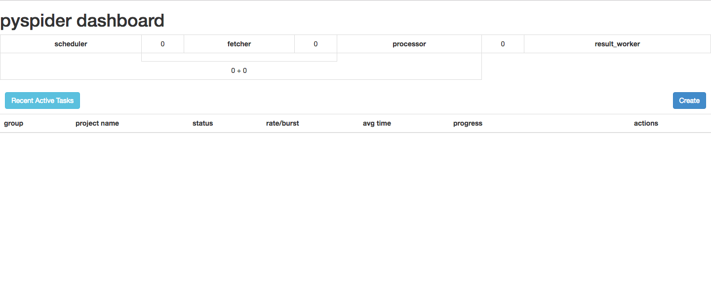

# PySpider


版本：v0.3.7

一个国人编写的强大的网络爬虫系统并带有强大的 WebUI。分布式架构，支持多种数据库后端，强大的 WebUI 支持脚本编辑器，任务监视器，项目管理器以及结果查看器。

## PySpider 后端服务

### 申请 PySpider 实例

查看后端服务、申请后端服务实例、绑定后端服务实例参见功能介绍《第四节 后端支持服务》章节。

### PySpider 仪表盘

 

### PySpider 实例环境变量举例

- BSI:

```
- name: BSI_PYSPIDER_PYSPIDERTEST_HOST
  value: sb-gemizrxdog4fy-pyspdr.service-brokers.svc.cluster.local
- name: BSI_PYSPIDER_PYSPIDERTEST_PORT
  value: "5000"
```

- JSON:

```
{
  "PySpider": [
    {
      "name": "PySpider-test", 
      "label": "", 
      "plan": "standalone", 
      "credentials": {
        "Host": "sb-gemizrxdog4fy-pyspdr.service-brokers.svc.cluster.local", 
        "Name": "", 
        "Password": "", 
        "Port": "5000", 
        "Uri": "", 
        "Username": "", 
        "Vhost": ""
      }
    }
  ]
}
```

### 使用 PySpider 实例

- 创建 bs 得到 dashboardurl，访问 dashboard 使用即可。

## 其他文档

- 官方网站： http://docs.pyspider.org/en/latest/
- 官方教程： http://docs.pyspider.org/en/latest/tutorial/