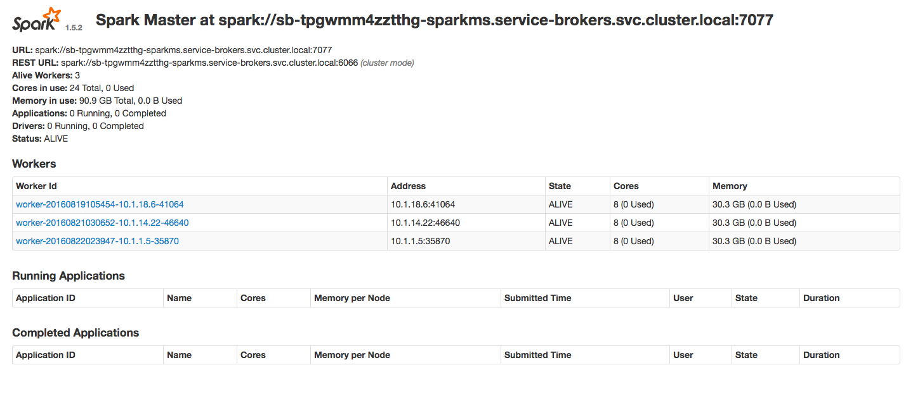

# Spark


版本：v1.5.2

Spark 是 UC Berkeley AMP lab 所开源的类 Hadoop MapReduce 的通用并行框架。Spark 启用了内存分布数据集，除了能够提供交互式查询外，还可以优化迭代工作负载。

## Spark 后端服务

### 申请 Spark 实例

查看后端服务、申请后端服务实例、绑定后端服务实例参见功能介绍《第四节 后端支持服务》章节。

### Spark 仪表盘




### Spark 实例环境变量举例

- BSI:

```
- name: BSI_SPARK_SPARKTEST_PASSWORD
   value: e149049f1ddeeac99f0b2b3de5a50e03
- name: BSI_SPARK_SPARKTEST_HOST
  value: sb-tdgon43zxtpo6-sparkms.service-brokers.svc.cluster.local
- name: BSI_SPARK_SPARKTEST_PORT
   value: "7077"
- name: BSI_SPARK_SPARKTEST_URI
   value: 'spark: spark://sb-tdgon43zxtpo6-sparkms.service-brokers.svc.cluster.local:7077
            zeppelin: http://sb-tdgon43zxtpo6-spark-zeppelin-servicebroker.app.dataos.io:80'
```

- JSON:

```
{
  "Spark": [
    {
      "name": "spark-test", 
      "label": "", 
      "plan": "One_Worker", 
      "credentials": {
        "Host": "sb-tdgon43zxtpo6-sparkms.service-brokers.svc.cluster.local", 
        "Name": "", 
        "Password": "e149049f1ddeeac99f0b2b3de5a50e03", 
        "Port": "7077", 
        "Uri": "spark://sb-tdgon43zxtpo6-sparkms.service-brokers.svc.cluster.local:7077, zeppelin: http://sb-tdgon43zxtpo6-spark-zeppelin-servicebroker.app.dataos.io:80", 
        "Username": "", 
        "Vhost": ""
      }
    }
  ]
}
```

### 使用 Spark 实例

- Spark 实例与服务绑定后，使用BSI_SPARK_SPARKTEST_URI 以及 BSI_SPARK_SPARKTEST_PASSWORD 等环境变量连接 Spark 实例。

## 其他文档

- 官方文档： http://spark.apache.org/
- 帮助文档： http://spark.apache.org/docs/1.5.2/
- API 文档： http://spark.apache.org/examples.html


