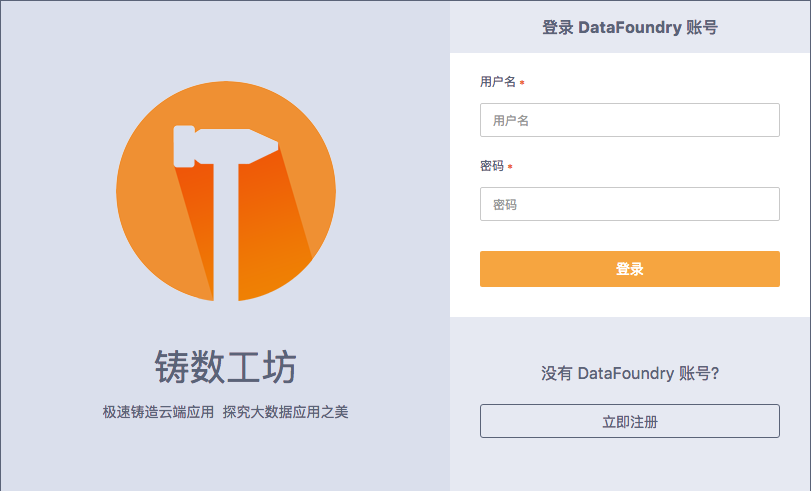
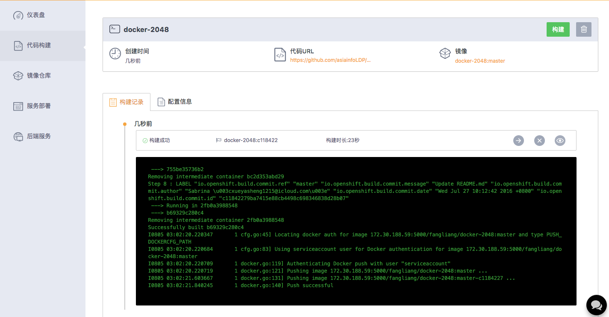
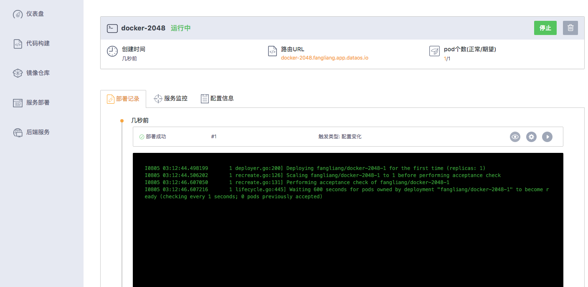
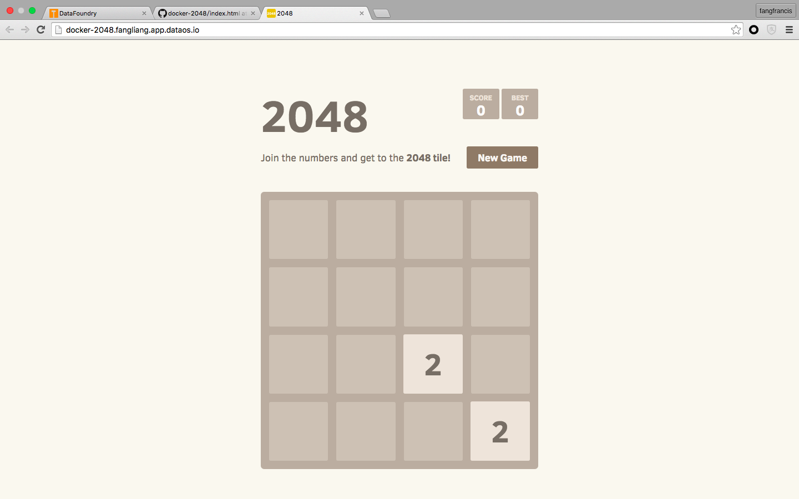
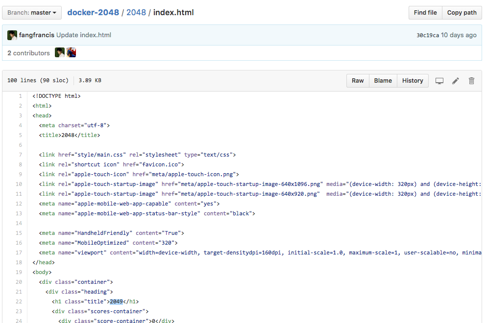
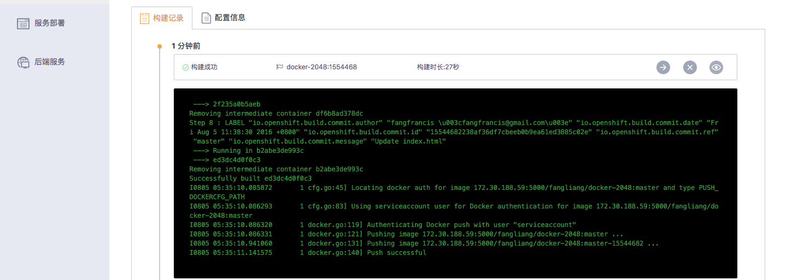
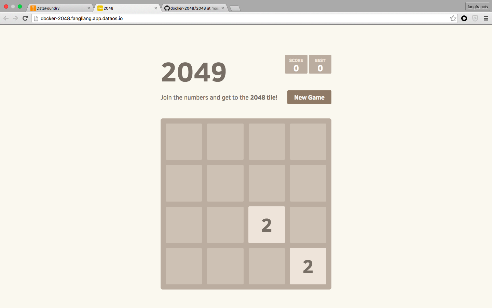
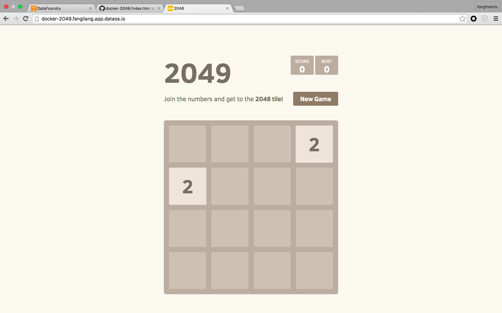

# 第三节：进行 CI/CD - 2048

> 本教程基于 DataFoundry 经典界面编写，考虑到产品的快速演进，部分步骤和图示可能已经改变。


<video id="my-video" class="video-js" controls preload="auto" width="100%" poster="img/GuestBook_Chapter_3.jpg" data-setup='{"aspectRatio":"16:10"}'>
 <source src="https://s3.cn-north-1.amazonaws.com.cn/shipingjiaoben/GuestBook_Chapter_3.mp4" type='video/mp4' >
 <p class="vjs-no-js">
 To view this video please enable JavaScript, and consider upgrading to a web browser that
 <a href="http://videojs.com/html5-video-support/" target="_blank">supports HTML5 video</a>
 </p>
</video>



## 1 第三节所覆盖的知识点

在第三节，我们将学会：

* 对部署的应用进行 CI/CD 配置

## 2 关于 2048 应用

2048 是一款数字益智游戏，相同数字的方块合并在一起时会相加。每一回合都会多出一块写有 2 或者 4 的方块，当方块无法移动时游戏结束。玩家要想办法在这个小小的 16 个格子中凑出一块带有 2048 （或更大）的方块。

## 3 开始前的准备工作

在你开始之前，你需要在 DataFoundry 注册一个帐号。

对于图形界面操作，你还需要以下浏览器之一：

* Firefox 15 或以上
* Chrome 21 或以上
* Internet Explorer 10 或以上
* Safari 7 或以上

对于命令行操作，你还需要下载 OpenShift 客户端：

* [Linux 32bit](https://s3.cn-north-1.amazonaws.com.cn/datafoundry/client/linux-32bit.tar.gz)
* [Linux 64bit](https://s3.cn-north-1.amazonaws.com.cn/datafoundry/client/linux-64bit.tar.gz)
* [Mac](https://s3.cn-north-1.amazonaws.com.cn/datafoundry/client/mac.zip)
* [Windows](https://s3.cn-north-1.amazonaws.com.cn/datafoundry/client/windows.zip)

Fork 2048 源码到自己的代码仓库：

* 官方版（含 dockerfile），[https://github.com/alexwhen/docker-2048](https://github.com/alexwhen/docker-2048)

## 4 Step by Step 详细操作

下面分别对图形界面和命令行两种方式进行介绍。

### 4.1 图形界面操作

#### Step 1：代码构建

1）登录平台：


2）在左侧菜单中点击“代码构建”、“新建构建”：


3）在“构建名称”中输入“docker-2048”，在“代码 URL”中选择 GitHub，并选择相应项目和代码分支：


4）点击“开始构建” ，可以看到构建记录和日志：


#### Step 2：服务部署

1）在左侧菜单中点击“服务部署”，选择相应镜像，并填写“服务名称”、“容器名称”、容器启动时占用的端口和对应服务的端口，点击创建服务：


2）在“服务详情”页的“高级配置”区域，可以看到“路由设置”开关，在这里可以为服务配置 route 信息：


3）在“自动部署”区域，进行 CI/CD 选项配置，勾选“镜像变化触发自动部署”、“配置变化触发自动部署”：


注：

* 勾选“镜像变化触发自动部署”后，当容器所基于的镜像发生改变时，就会触发服务基于新的镜像重新部署；
* 勾选“配置变化触发自动部署”后，当服务的配置信息发生改变时，就会触发服务基于新的配置重新部署。

4）配置完成后，点击“创建服务”，数十秒内即可完成服务部署。部署完成后，点击“路由 URL”下方的URL，即可访问你所部署的服务：



#### Step 3:通过镜像变化触发自动部署

1）在 GitHub 上，修改 docker-2048 页面源代码，保存并记录 commit id：


2）进入“代码构建”，可以发现镜像正在重新构建，即代码变化触发了镜像的自动构建，且此处的 commit id 应与上一步所记录的 commit id 相同：


3）构建完成后，进入“服务部署”，点击 docker-2048，可以发现服务已重新部署，即镜像变化触发了服务的自动部署：


4）部署完成后，即可访问新部署的服务，此处可以看到标题已变为“2049”：


#### Step 4：通过配置变化触发自动部署

1）进入“服务部署”，点击 docker-2048，进入“配置信息” Tab 页：


2）修改域名部分为“docker-2049”，点击“更新”，会自动触发重新部署：


3）部署完成后，即可访问新部署的服务，此处可以看到域名前缀已变为“docker-2049”：


### 4.2 命令行操作

我们可以通过命令对 dc，bc 和 rc 的 triggers 进行操作来触发 CI/CD，这里的 triggers 即一些能够引起触发的条件。

DataFoundry 中包括两种 triggers，一种是代码构建处的“自动构建“\(由代码变化触发\)，另一种是服务部署处的“镜像变化触发自动部署”和“配置变化触发自动部署”。

#### 4.2.1 自动构建

“自动构建”需要用到 bc 中的 Webhook，可通过以下命令查看：

```
$ oc describe bc docker-2048
  Name:                   docker-2048
  Created:                13 minutes ago
  Labels:                 <none>
  Annotations:            repo=docker-2048
                          user=asiainfoLDP
  Latest Version:         1
  Strategy:               Docker
  URL:                    https://github.com/asiainfoLDP/docker-2048.git
  Ref:                    master
  Source Secret:          fangliang-github-s77yfxkx
  Output to:              ImageStreamTag docker-2048:master
  Fail Build After:       30m0s
  Triggered by:           <none>
  Webhook GitHub:         https://dev.dataos.io:8443/oapi/v1/namespaces/fangliang/buildconfigs/wordpress/webhooks/005758aa561eca36bbbdf2437d397200/github
```

将 Webhook GitHub 字段值复制到 GitHub 上的相应代码仓库中，即可实现代码变化时的自动构建。

#### 4.2.2 自动部署

1）查看 triggers

首先列出所有触发自动部署的 triggers：

```
$ oc set triggers dc/docker-2048
```

会得到以下结果：

```
  NAME                                TYPE    VALUE                                AUTO
  deploymentconfigs/docker-2048       config                                       true
  deploymentconfigs/docker-2048       image   docker-2048:master (docker-2048)     true
```

我们可以看到以上结果中列出了两个 triggers 条件，分别为 dc 配置文件发生改变时触发自动部署和 docker-2048:master 这个镜像发生改变时触发自动部署。

2）删除 triggers

* 删除所有 triggers：

```
$ oc set triggers dc/docker-2048 --remove-all
```

再次查看 dc/docker-2048 的 triggers 时，我们会发现没有任何 trigger 条件了。

* 删除单个 trigger：

```
$ oc set triggers dc/docker-2048 --from-config --remove
```

执行完这条命令后，当 dc 的配置文件发生改变时，就不会触发自动部署了。

3）增加 triggers

下面我们来逐步为它增加 triggers，以此来熟悉增加 trigger 的命令。

* 增加镜像发生改变时触发部署的 trigger：

```
$ oc set triggers  dc/docker-2048 --from-image=docker-2048:master --containers=docker-2048
```

这条命令中，需要指定`--containers`，否则会报错。`--containers`内容为 pod 配置文件中 Containers 字段下的容器名字。

* 增加 dc 配置文件发生改变时触发部署的 trigger：

```
$ oc set triggers  dc/docker-2048 --from-config=true
```

