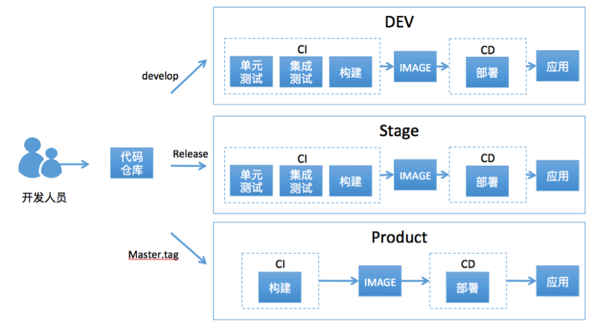

# 在DataFoundry上应用生命周期

DataFoundry作为一个大数据PaaS平台，不仅为开发者提供了即开即用的大数据服务组件，同时践行敏捷开发提供了整个应用生命周期包括规划、需求、开发、测试、上线等环节开发及管理。

在DataFoundry为了践行敏捷开发、提高应用交付效率，可根据Gitflow流程在在DataFoundry上构建一个稳定高效的持续集成持续部署体系。

在DataFoundry上开发、持续集成、持续部署整体分为几个部分：
1、在代码仓库建立develop、release、master三个分支，现阶段我们支持GitHub及GitLab代码仓库；
2、开发阶段将代码提交到代码仓库的develop分支；
3、在DEV环境，代码发生变化时，触发自动集成（CI）步骤，自动进行代码构建，构建出新镜像；
4、在DEV环境，镜像发生变化时，触发自动部署（CD）步骤，自动部署新镜像；
5、服务开发阶段完成后，将代码提交release分支；
6、在Stage环境，代码发生变化时，触发自动集成（CI）步骤，自动进行代码构建，构建出新镜像；
7、在Stage环境，镜像发生变化时，触发自动部署（CD）步骤，自动部署新镜像；
8、服务开发阶段完成后，代码提交到master分支，打版本tag；
9、在Product环境，代码发生变化时，触发自动集成（CI）步骤，自动进行代码构建，构建出新镜像；
10、在Product环境，镜像发生变化时，触发自动部署（CD）步骤，自动部署新镜像；

基于这个流程，用户可以做到提交代码后无需任何人工操作，即可完成全部部署工作，做到一键式持续集成和部署。