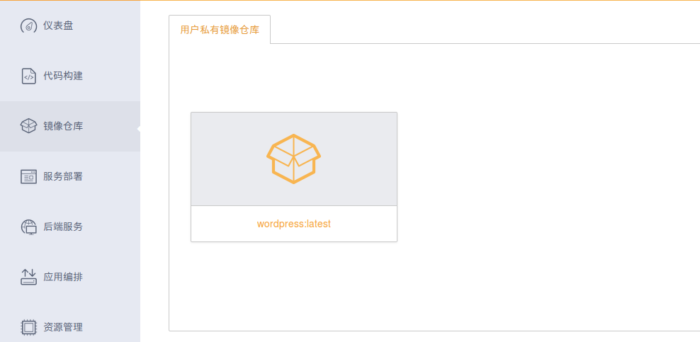

# 第四章 镜像构建及持续集成

## 镜像构建

构建策略为 Docker 的构建过程，以下以代码托管在 GitHub 上举例说明。

* 代码仓库为公开

使用以下命令创建一个构建：

```
$ oc new-build https://github.com/asiainfoLDP/datahub_wordpress.git#master
```

运行结果如下：

```
--> Found Docker image a913b48 (5 days old) from Docker Hub for "wordpress"
    An image stream will be created as "wordpress:latest" that will track the source image
    A Docker build using source code from https://github.com/asiainfoLDP/datahub_wordpress.git#master will be created
    The resulting image will be pushed to image stream "datahubwordpress:latest"
    Every time "wordpress:latest" changes a new build will be triggered
    Creating resources with label build=datahubwordpress ...
    imagestream "wordpress" created
    imagestream "datahubwordpress" created
    buildconfig "datahubwordpress" created
    Success
    Build configuration "datahubwordpress" created and build triggered.
    Run 'oc logs -f bc/datahubwordpress' to stream the build progress.
```

* 根据 Dockerfile 中的 `from wordpress`，将为 wordpress:latest 创建 imagestream，存放 wordpress:latest 镜像。
* 创建基于代码库 [https:\/\/github.com\/asiainfoLDP\/datahub\_wordpress.git\#master](https://github.com/asiainfoLDP/datahub_wordpress.git#master) 的构建。
* 创建用来存放构建完成后的镜像的 imagestream:datahubwordpress。
* 当 from 的基础镜像发生改变时，将触发自动构建。
* 可以通过 `oc logs -f bc/datahubwordpress` 查看构建日志。

查看构建的配置文件：

```
$ oc export bc datahubwordpress
```

配置文件如下：

```
        apiVersion: v1
        kind: BuildConfig
        metadata:
          annotations:
            openshift.io/generated-by: OpenShiftNewBuild
          creationTimestamp: null
          labels:
            build: datahubwordpress
          name: datahubwordpress
        spec:
          output:
            to:
              kind: ImageStreamTag
              name: datahubwordpress:latest
          postCommit: {}
          resources: {}
          source:
            git:
              ref: master
              uri: https://github.com/asiainfoLDP/datahub_wordpress.git
            secrets: []
            type: Git
          strategy:
            dockerStrategy:
              from:
                kind: ImageStreamTag
                name: wordpress:latest
            type: Docker
          triggers:
          - github:
              secret: wvnIqmIoLu_5HiMqQVsM
            type: GitHub
          - generic:
              secret: mlEnK8yxlHUr9jdadyWJ
            type: Generic
          - type: ConfigChange
          - imageChange: {}
            type: ImageChange
        status:
          lastVersion: 0
```

* 代码仓库为私有  

第一步：创建 secret，用来存储用户名和密码

```
$ oc secrets new-basicauth secretname --username=github 用户名 --password=github 密码
```

secretname 为自己取的名字。

第二步： 将 secret 加入 serviceaccount\/builder

```
$ oc secrets add serviceaccount/builder secret/secretname
```

由于构建过程默认使用 serviceaccount\/builder，所以只需将 secret 加入 serviceaccount\/builder 即可。

第三步：

```
$ oc new-build https://github.com/asiainfoLDP/datahub_wordpress.git#master --build-secret=secretname
```

查看构建的配置文件：

```
        apiVersion: v1
        kind: BuildConfig
        metadata:
          annotations:
            openshift.io/generated-by: OpenShiftNewBuild
          creationTimestamp: null
          labels:
            build: datahubrepository
          name: datahubrepository
        spec:
          output:
            to:
              kind: ImageStreamTag
              name: datahubrepository:latest
          postCommit: {}
          resources: {}
          source:
            git:
              uri: https://github.com/asiainfoLDP/datahub_repository.git
            secrets:
            - destinationDir: .
              secret:
                name: secretname
            type: Git
          strategy:
            dockerStrategy:
              from:
                kind: ImageStreamTag
                name: golang:1.5.1
            type: Docker
          triggers:
          - github:
              secret: a7c_hhXMm7XTl_2OcGVC
            type: GitHub
          - generic:
              secret: XJZ3c0g3rOh1Fzxkvumu
            type: Generic
          - type: ConfigChange
          - imageChange: {}
            type: ImageChange
        status:
          lastVersion: 0
```

可以看到 Git 段中的 secret 部分添加了 secret，new-build 的时候还会提示输入用户名和密码，bc 中的secret 在 start-build 的构建过程中起作用，会带着认证信息去 git clone 私有仓库的代码。

* 在构建中使用私有镜像仓库   

当 Dockerfile 中 from 的是私有镜像，或者构建镜像要推送到私有镜像仓库时，使用以下方法提供私有镜像仓库的认证信息。

第一步：创建 secret

```
$ oc secret new registry /root/.docker/config.json
```

第二步：添加 secret 到 serviceaccount\/builder

```
$ oc secrets add serviceaccount/builder secrets/registry --for=pull
```

第三步：或者直接在 bc 中添加 pull 和 push 的 secret：

```
          apiVersion: v1
          kind: BuildConfig
          metadata:
            annotations:
              openshift.io/generated-by: OpenShiftNewBuild
            creationTimestamp: null
            labels:
              build: datahubwordpress
            name: datahubwordpress
          spec:
            output:
              pushSecret:
                name: registry
              to:
                kind: DockerImage
                name: registry.dataos.io/harbor/test:test
            postCommit: {}
            resources: {}
            source:
              git:
                uri: https://github.com/cherry4477/datahub_wordpress.git
              secrets: []
              type: Git
            strategy:
              dockerStrategy:
                from:
                  kind: DockerImage
                  name: registry.dataos.io/harbor/harbor-ui:latest
                pullSecret:
                  name: registry
              type: Docker
            triggers:
            - github:
                secret: spEagYnckgpU2_aQ0mKM
              type: GitHub
            - generic:
                secret: 8vDO0nMFXfPOdRgT2I43
              type: Generic
            - type: ConfigChange
          status:
            lastVersion: 0
```

## 持续集成

有三种方式触发自动构建的持续集成：Webhook、Image Change 和 Configuration Change。三种方式可以同时使用。

一般在 bc 生成时，会自动加上 trigger 。Webhook 需要先去页面获取到，然后配到代码仓库的 Webhook 中：

第一步：登录平台页面，点击浏览 builds，获取到 Github Webhook

第二步：将 Webhook 配置到 Github

配置完成后，当代码发生任何改变，都将触发自动构建。

## 通过界面构建镜像

1. 登录平台


2. 在左侧菜单中点击“代码构建”


3. 点击“新建构建”，输入“构建名称”、选择代码仓库后，点击“开始构建”


4. 在状态页中可以查看构建状态


5. 构建完成后可以镜像仓库中查看本次构建的镜像，鼠标移动到镜像仓库上后，可以点击“部署最新版本”来部署该镜像


6. 构建完成后可以配置持续集成，当Git代码发生变化时自动触发构建。可以从“构建配置”选择“自动构建”，系统会自动在代码仓库添加 Webhook 触发自动构建。


