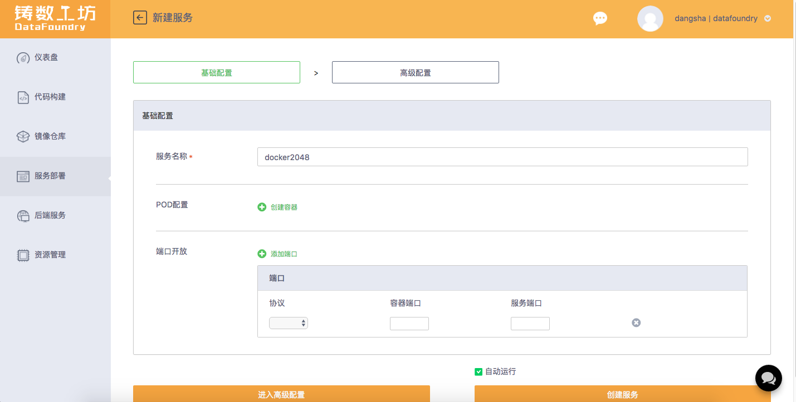

# 通过界面部署服务

1. 登录DataFoundry，点击“服务部署”、“新建服务”；

输入“服务名称”、“创建容器”，配置容器包括：容器名称、镜像名称及版本。如果需要开放端口，可以选择容器要开放的端口。配置信息包括：“端口协议”、”容器端口“、”服务端口“。

1. 服务高级配置

配置服务副本数量、重启策略、路由、选择要绑定的后端服务、配置环境变量。点击创建服务。

1. 支持的镜像仓库
DataFoundry支持三种镜像仓库：

 - 用户内置镜像仓库：通过DataFoundry平台构建的镜像；

 - 仓库镜像：registry.dataos.io中用户自己私有的镜像；

 - 镜像中心：镜像中心包含DataFoundry官方镜像、Docker官方镜像的镜像。

