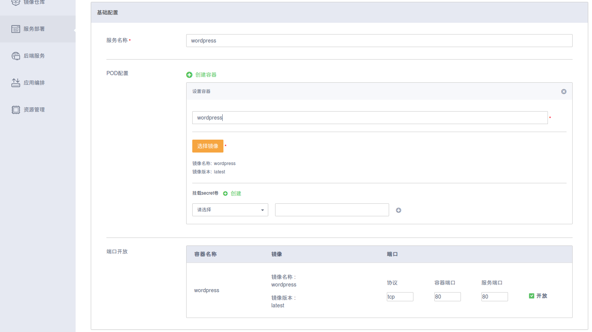
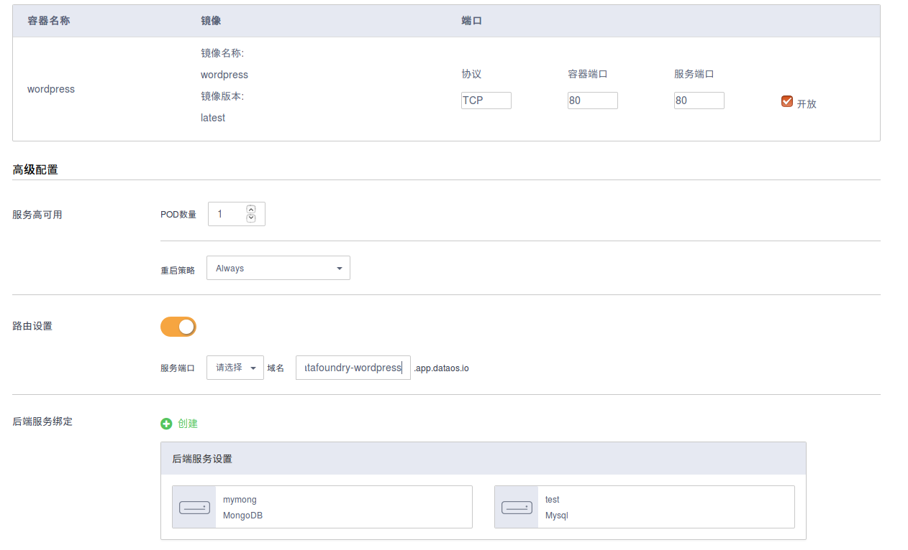

##  第一节  hello wordpress  
###  1. 　　
登录datafoundry平台  
  ```  
  $  oc login https://datafoundry-endpoint.xxx.xxx -u username -p password  
  ```  
### 2. 　　
创建WordPress部署任务  
  ```  
  oc new-app https://github.com/datafoundry/wordpress.git  
 Found Docker image 10e778c (12 days old) from Docker Hub for "library/php:5.6-apache"

    * An image stream will be created as "php:5.6-apache" that will track the source image
    * A Docker build using source code from https://github.com/datafoundry/wordpress.git will be created
      * The resulting image will be pushed to image stream "wordpress:latest"
      * Every time "php:5.6-apache" changes a new build will be triggered
    * This image will be deployed in deployment config "wordpress"
    * Port 80/tcp will be load balanced by service "wordpress"
      * Other containers can access this service through the hostname "wordpress"
    * WARNING: Image "wordpress" runs as the 'root' user which may not be permitted by your cluster administrator

 Creating resources with label app=wordpress ...
    imagestream "php" created
    imagestream "wordpress" created
    buildconfig "wordpress" created
    deploymentconfig "wordpress" created
    service "wordpress" created
 Success
    Build scheduled, use 'oc logs -f bc/wordpress' to track its progress.
    Run 'oc status' to view your app.
  ``` 
其中：  
  * 　　`oc` 是datafoundry平台的命令行控制工具，他提供了对datafoundry平台的所有控制功能  
  * 　　`new-app`是datafoundry平台的操作命令，它可以通过后续指定的若干参数完成一个应用的构建和发布  
  * 　　`https://github.com/datafoundry/wordpress.git` 是一个git代码仓库，它是我们要在datafoundry平台发布的第一个应用  
  * 　　输入命令并点击回车后，命令行会等待一段时间，等待时间长短与代码仓库的代码量，以及命令执行位置与github的网络条件有关，这段等待时间中oc会先clone代码仓库到本地，对代码仓库中的dockerfile进行解析，主要是获取基础镜像信息
    
1.  　　通过输出信息我们可以看到datafoundry平台构建和发布应用的几个基本要素  
  * 　　`buildconfig`，可以简写为bc,用来存储镜像构建所需的配置信息，包括最基本的代码仓库地址，构建分支、tag、commit-id信息，dockerfile位置，镜像构建输出位置及名称，在相对高级的应用场景下还包含ci出发器，github webhock、私有git仓库登录信息等  
  * 　　`deployconfig`，简写为dc，用来存储镜像部署所需的配置信息，  
  * 　　`service`，简写为svc,是平台提供应用高可用和服务发现功能的入口  
  * 　　`imagestream`，简写为is,是平台显示私有仓库镜像信息的入口，通过他也是平台CD功能的触发入口  

*  　　这些基础要素的信息可以通过如下的命令进行查询：  
  ```  
  oc get buildconfig <buildconfig-name>
  oc get deployconfig <deployconfig-name>
  oc get service <service-name>
  oc get imagestream <imagestream-name>
  ```  
1.  　　还可以通过如下命令了解基础要素的详情  
  ```  
  oc describe buildconfig <buildconfig-name>  
  oc describe deployconfig <deployconfig-name>  
  oc describe service <service-name>  
  oc describe imagestream <imagestream-name>  
  ```  
1.  　　还可以通过如下命令修改基础要素的配置,具体修改的方式和内容讲在后续针对每个基础要素的专题介绍中展开  
  ```  
  oc edit buildconfig <buildconfig-name>  
  oc edit deployconfig <deployconfig-name>  
  oc edit service <service-name>  
  oc edit imagestream <imagestream-name>  
  ```  
　　在简单了解了这些datafoundry平台的基本要素之后，我们来看看命令执行的结果，在这里要特别强调的是datafoundry平台是一个异步设计的命令绝大多数命令的返回结果仅仅代表系统已经接受到了请求，并不表示相关操作已经完成，也就是`oc new-app`执行成功后只是个开始，我们需要逐个确认每个基本要素的执行情况，只有当所有的基本要素都就位之后才表示一个应用真真发布成功。  
  　　不过也有可能出现`oc new-app`命令本身就执行失败或部分失败的问题，大体上有如下几种可能性：  
  * 　　代码仓库不可达，因为网络问题或者仓库地址错误或者私有代码仓库密码错误，导致oc命令不能正确clone代码仓库内容  
  * 　　关键基础要素名称重复，如果平台中已经存在相同名称的基础要素，那么对该基础要的创建工作就会失败，当然基础要素创建的失败并不代表整个应用发布过程的失败，如果旧的基础要素信息满足要求的话是可以继续使用的而不用在意执行`new-app`过程中出现的错误提示，但是如果旧的基础要素信息不符合应用或者服务发布的要求，那么需要删除这些基础要素，基础要素的名称可以通过`new-app`的错误提示确定，也可以通过相关要素的查询命令进行查询，删除这些基础要素的命令是：  

    ```   
  oc delete buildconfig <buildconfig-name>  
  oc delete deployconfig <deployconfig-name>  
  oc delete service <service-name>  
  oc delete imagestream <imagestream-name>  
    ```  
    
## 通过界面部署wordpress
1.  登陆平台  
  
  
1. 在左侧菜单中点击“代码构建”  
   
1.  点击“新建构建”
  
1.  输入”构建名称“、”代码URL“后点击”开始构建“
  
1.  在状态页中中可以查看到构建状态，构建完成后可以镜像仓库中查看到本次构建的镜像，鼠标移动到镜像仓库上后可以点击”部署最新版本“来部署该镜像
 
2.    在部署容器镜像时，可以填入“服务名称”、“容器名称”，还需要填入容器启动时占用的端口和对应服务的端口，点击“创建服务”
  
1.    点击“创建服务”后，界面进入“服务详情”页，点击”启动“来触发容器启动
 
1.    在”服务详情“页下”高级配置“区域，可以看到”路由设置“开关，在这里可以为服务配置route信息       

1.  配置完成后点击“更新”保存已修改的服务配置
